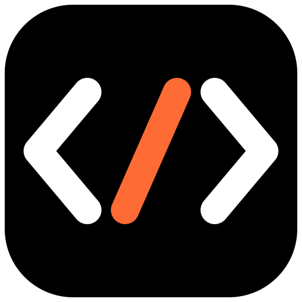

<p align="center">
  
</p>

<h3 align="center">
vsurf: A Browser-First RLM Agent
</h3>

<p align="center">
  <a href="packages/coding-agent/docs/index.md">Documentation</a> | <a href="README_ZH.md">中文</a>
</p>

vsurf is an open-source coding and research agent for general and long-running work, with first-class browser automation. Every RLM agent gets its own tab in one shared browser, so multiple agents can work in parallel - each seeing only its own tabs.

It is designed around two core abstractions:

- The **Recursive Language Model (RLM)** treats context as variables (*prompt-as-a-variable*) and tools like recursive subagents as function calls (*programmatic sub-agent calling*) inside a persistent REPL.
- The **Continual Harness** stores supplemental prompts, memories, skill descriptions, and reusable subagent specifications as durable state that vsurf can refine through small, evidence-backed updates, local to the session by default.

## Browser-Native Agents

vsurf extends the RLM agent model with a shared real browser (your own Chrome/Edge or a managed Chromium) over a single CDP connection:

- **One browser, many agents.** All agents share one browser instance; each agent is assigned its own tabs and never sees another agent's tabs.
- **Parallel browsing.** Multiple agents can browse, fill forms, scrape, and QA pages at the same time, each in its own tab, without window sprawl or profile conflicts.
- **Screenshot-first.** Vision models act by screenshot plus coordinate clicks, which pass through iframes and shadow DOM; text-only models fall back to DOM snapshots with indexed clicking.
- **Your browser, adopted safely.** Agents can adopt tabs you already have open; adopted tabs are only released, never closed. Agent-created tabs close automatically when the session ends.

## Getting Started

Requires Node.js >= 22.8.0. A local Chrome, Edge, or Chromium is recommended for the browser module.

Install the `vsurf` command from npm:

```bash
npm install -g vsurf
```

Then start vsurf from the repository or directory you want it to work in:

```bash
cd /path/to/project
vsurf
```

On first launch, run `/login` to choose a subscription or API-key provider. vsurf works in the current directory and can run commands and modify files there. Use a disposable clone, clean worktree, or another checkpoint you can inspect and restore.

### Build from source

```bash
git clone https://github.com/warmshao/vsurf.git
cd vsurf
npm install
npm run build
npm install -g .
```

To run from a checkout without a global install:

```bash
./vsurf.sh
```

> [!WARNING]
> vsurf executes model-generated Python, browser actions, and project commands with your user permissions. Its worker and kernel processes improve lifecycle isolation and recovery; they are **not** a security sandbox. Review changes and use trusted repositories, instructions, skills, and extensions only. Run untrusted code or instructions in an external sandbox or restricted environment.

Useful commands:

```bash
vsurf agents                   # Browse running, idle, and saved sessions
vsurf attach <agent>           # Reattach to a running session
vsurf --resume [path|id]       # Browse sessions or resume one directly
vsurf status                   # Inspect background service state
vsurf doctor [--fix]           # Inspect or repair the installation
vsurf shutdown                 # Stop the agent, worker, and background service
```

## Built for Long-Running Work

vsurf is built for long-running work, especially with parallel browser agents. These features are available in the TUI and in autonomous mode.

- **Persistent IPython control environment:** file operations, shell commands, tool use, subagents, and context management happen through code.
- **Built-in subagents:** spawn real child agents for parallel or background work and return results programmatically.
- **Continual Harness:** `/refine` persists focused, reviewable lessons as supplemental prompts, memories, skills, or subagent specifications, with recorded history and rollback.
- **Executable skills:** skills are importable Python packages; the built-in skill creator turns recurring workflows into project or personal skills.
- **Daemon-backed continuity:** active sessions, IPython state, schedules, and subagents keep running when the terminal detaches and can be reattached later.
- **Direct agent-to-agent communication:** running agents and retained subagents discover one another, exchange messages, and steer active work.
- **Heartbeats, schedules, and goals:** `/heartbeat`, `rlm_heartbeat`, and `vsurf schedule` re-enter sessions periodically; `/goal` keeps objectives active across turns.
- **Bounded autonomous mode:** `/autonomous` continues within configured turn, token, and time budgets and can run user-defined quality gates.

## Documentation

- [Quickstart](packages/coding-agent/docs/quickstart.md) - install, authenticate, and run a first session
- [Usage and CLI reference](packages/coding-agent/docs/usage.md) - commands, sessions, autonomous limits, and output modes
- [Long-running and background agents](packages/coding-agent/docs/long-running-agents.md) - detach and reattach, goals, heartbeats, and schedules
- [RLM programming model](packages/coding-agent/docs/rlm.md) - persistent IPython, subagents, skills, and the trust model
- [RLM runtime](packages/coding-agent/docs/rlm-runtime.md) - shared browser, per-agent tabs, and the Python runtime
- [Browser](packages/coding-agent/docs/browser.md) - the shared browser daemon: CDP connection, tab ownership, and managed launches
- [JSON mode](packages/coding-agent/docs/json.md) and [RPC mode](packages/coding-agent/docs/rpc.md) - headless automation and integrations
- [Skills](packages/coding-agent/docs/skills.md) - install and create reusable capabilities
- [Provider setup](packages/coding-agent/docs/providers.md) - subscription and API-key providers
- [Architecture overview](packages/coding-agent/docs/architecture.md) - daemon, worker, kernel, and persistence boundaries
- [Development](packages/coding-agent/docs/development.md) - build and run from source

## Contributing

Open a GitHub issue or discussion in [warmshao/vsurf](https://github.com/warmshao/vsurf) for questions, bug reports, and feature requests. Read the [contribution guidelines](CONTRIBUTING.md) for the full process.

## Acknowledgements

vsurf is built on [Prime Agent](https://github.com/PrimeIntellect-ai/prime-agent), which is itself built on [`pi`](https://github.com/badlogic/pi-mono). We thank their authors for their valuable work.

## License

MIT